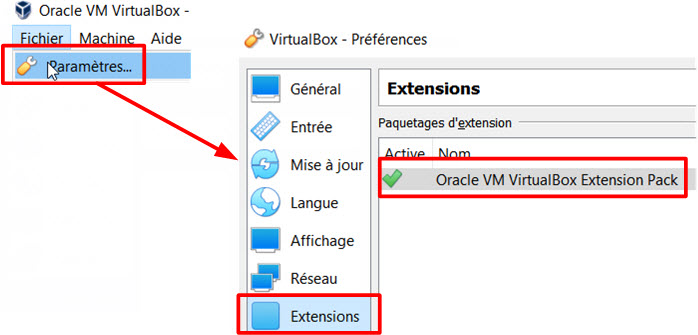
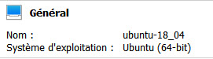
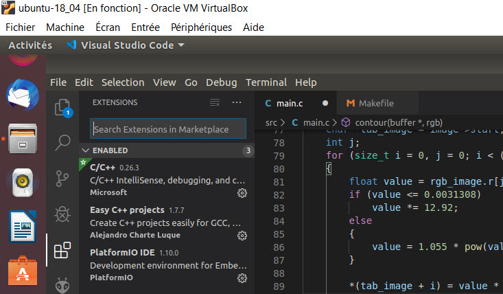

### use webcam in linux guest / windows host
**1. we suppose you have installed Virtual Box on Windows 10 and add ubuntu 18.04 machine :**

**2. You need to Install VirtualBox Extension Pack on Windows :** [Virtual Box Download ](https://www.virtualbox.org/wiki/Downloads " get last version of virtualbox and extension pack")   
it's necessary to add extension pack for :
- *Support for USB 2.0 and USB 3.0 devices.* USB devices such as network adapters, flash drives, hard disks, web cams etc., that are inserted into physical USB ports of a host machine can be attached to a virtual machine running on VirtualBox. As a result, you can use a physical USB device in a guest operating system (OS).
- *Host webcam pass-through.* With this feature you can connect your host webcam to a guest machine. The advantage is that you can use a webcam which is not supported by the guest operating system of your VM.



**3. On windows 10 open cmd windows and list the webcams  :** the command is **VBoxManage list webcams**
```bash
	c:\Program Files\Oracle\VirtualBox>VBoxManage list webcams
	Video Input Devices: 1
	.1 "Integrated Webcam"
	\\?\usb#vid_0bda&pid_5650&mi_00#6&1d5726d5&0&0000#{65e8773d-8f56-11d0-a3b9-00a0c9223196}\global
```
**4. if you have one webcam on your host, add this webcam on your linux machine:**  if you have only one webcam you will attach .1 (your webcam)

```bash
	VboxManage controlvm "ubuntu-18_04" webcam attach .1
```
**5. launch your linux machine and test the webcam with cheese:**

**6. install code (VScode):** [VScode install ](https://linuxize.com/post/how-to-install-visual-studio-code-on-ubuntu-18-04/ "install vscode") 

**7. install plugin: Easy Cpp Projects**


**8. install library v4l2 for dev ** and verify what files have been installed  (you should see /usr/include/libv4l2.h) file that we will use in code

```bash
	sudo apt-get install libv4l-dev
	dpkg -L libv4l-dev

```
**8. Open folder vscode and test the code**
 