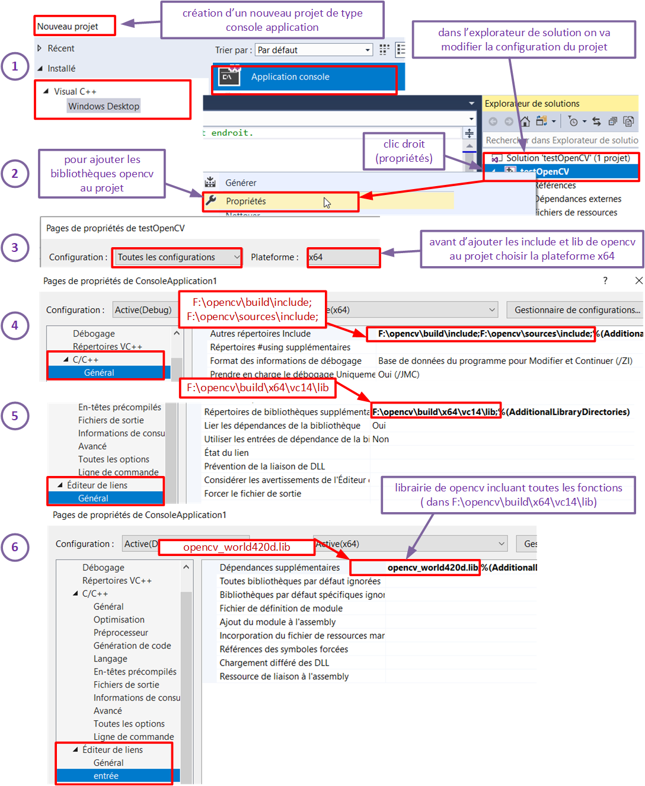

# Use webcam in linux guest / windows host in VScode

**1. we suppose you have installed Virtual Box on Windows 10 and add ubuntu 18.04 machine :**

**2. You need to Install VirtualBox Extension Pack on Windows :** [Virtual Box Download ](https://www.virtualbox.org/wiki/Downloads " get last version of virtualbox and extension pack")   
it's necessary to add extension pack for :
- *Support for USB 2.0 and USB 3.0 devices.* USB devices such as network adapters, flash drives, hard disks, web cams etc., that are inserted into physical USB ports of a host machine can be attached to a virtual machine running on VirtualBox. As a result, you can use a physical USB device in a guest operating system (OS).
- *Host webcam pass-through.* With this feature you can connect your host webcam to a guest machine. The advantage is that you can use a webcam which is not supported by the guest operating system of your VM.


**3. On windows 10 open cmd windows and list the webcams  :** the command is **VBoxManage list webcams**
```bash
	c:\Program Files\Oracle\VirtualBox>VBoxManage list webcams
	Video Input Devices: 1
	.1 "Integrated Webcam"
	\\?\usb#vid_0bda&pid_5650&mi_00#6&1d5726d5&0&0000#{65e8773d-8f56-11d0-a3b9-00a0c9223196}\global
```
**4. if you have one webcam on your host, add this webcam on your linux machine:**  if you have only one webcam you will attach .1 (your webcam)

```bash
	VboxManage controlvm "ubuntu-18_04" webcam attach .1
```
**5. launch your linux machine and test the webcam with cheese:**

**6. install code (VScode):** [VScode install ](https://linuxize.com/post/how-to-install-visual-studio-code-on-ubuntu-18-04/ "install vscode") 

**7. install plugin: Easy Cpp Projects:**


**8. install library v4l2 for dev :**  and verify what files have been installed  (you should see /usr/include/libv4l2.h) file that we will use in code

```bash
	sudo apt-get install libv4l-dev
	dpkg -L libv4l-dev

```
# A. test project 1 : vscode folder
**1. Open folder vscode and test the code**
in file vscode/src/main.c we will open /dev/video0 file (webcam) and use functions in main.c

	//we give en example of main : take picture of webcam input and write to file ppm.
	int main(int argc, char **argv)
	{
	    int fd = -1;
	    struct buffer image;
	    const char *dev_name = "/dev/video0";
	    fd = v4l2_open(dev_name, O_RDWR | O_NONBLOCK, 0);
	    if (fd < 0)
	    {
	        perror("Cannot open device");
	        exit(EXIT_FAILURE);
	    }
	    printCapabilities(fd, dev_name);
	    image = initCapture(fd, 640, 480);
	    captureImage(fd, image);
	    debug("SAVING TO in.ppm");
	    saveppm("in.ppm", image);
	    traitement(&image);
	    debug("SAVING TO out.ppm");
	    saveppm("out.ppm", image);
	    v4l2_munmap(image.start, image.length);
	    v4l2_close(fd);
	    return 0;
	}

 
# B. use webcam in linux guest / windows host with opencv

**B.1. install Opencv:** [Opencv install ](https://linuxize.com/post/how-to-install-opencv-on-ubuntu-18-04/  "install opencv in ubuntu 18_04 LTS") 

**B.2. Open folder vscode_opencv and test the code**
in file vscode_opencv/src/main.cpp you've got classifier test. But you can copy file saveImageGray.cpp from tmp/ to src and erase main.cpp. This code is quite identical of code from A.1 but with opencv framework.
We can go to [Opencv test](https://link.springer.com/chapter/10.1007/978-1-4302-6838-3_7#Sec24 "using opencv") for code explained.

	#include <opencv2/opencv.hpp>
	using namespace cv;
	using namespace std;
	int main()
	{
	VideoCapture cap(-1);
	//check if the file was opened properly
	if(!cap.isOpened())
	{
	cout << "Webcam could not be opened succesfully" << endl;
	exit(-1);
	}
	else
	{
	cout << "p n" << endl;
	}
	int w = 640;
	int h = 480;
	cap.set(CAP_PROP_FRAME_WIDTH, w);
	cap.set(CAP_PROP_FRAME_HEIGHT, h);
	Mat frame;
	cap >>frame;
	// converts the image to grayscale
	Mat frame_in_gray;
	cvtColor(frame, frame_in_gray, COLOR_RGB2GRAY);
	// process the Canny algorithm
	cout << "processing image with Canny..." << endl;
	int threshold1 = 0;
	int threshold2 = 80;
	//Canny(frame_in_gray, frame_in_gray, threshold2, threshold2);
	// saving the images in the files system
	cout << "Saving the images..." << endl;
	imwrite("captured.jpg", frame);
	imwrite("captured_with_edges.jpg", frame_in_gray);
	imwrite("opencv.jpg", frame);
	cap.release();
	return 0;
	}
	
**Somme remarks :**  
1. you will remark that file in .config\code\User\settings.json add includePath of opencv for intellisense. Copy configuration lines in this files open via Menu (File, Preferences, Settings, Extensions, Edit in settings.json) (Cf image). You must close and open VScode to active the changes : in alls projetcs intellisence will use /usr/local/incluse/opencv4 directory.
```bash
	{
	    "C_Cpp.default.systemIncludePath": [
	     "/usr/local/include/opencv4/"
	  ],
	  "files.autoSave": "afterDelay",
	}
```
")
2. you will see how the Makefile has been changed for opencv compile
 
	CXX		  := g++
	CXX_FLAGS := -Wall -Wextra  -ggdb 
	
	BIN		:= bin
	SRC		:= src
	INCLUDE	:= include
	LIB		:= lib
	
	
	LIBRARIES	:=-lv4l2 -lm
	EXECUTABLE	:= main
	
	OPENCV_LIBS = $(shell pkg-config --libs opencv4)
	OPENCV_INCLUDE = $(shell pkg-config --cflags opencv4)
	
	all: $(BIN)/$(EXECUTABLE)
	
	run: clean all
		clear
		./$(BIN)/$(EXECUTABLE)
	
	$(BIN)/$(EXECUTABLE): $(SRC)/*.cpp
		$(CXX) $(CXX_FLAGS) -DDEBUG -I$(INCLUDE) -L$(LIB) $^ -o $@ $(LIBRARIES) $(OPENCV_LIBS) $(OPENCV_INCLUDE)
	
	clean:
		-rm $(BIN)/*
		
# Use webcam in  windows with visual studio
**1. install visual studio comunity 2017 or 2019:** [Visual Studio Comunity 2019 ](https://visualstudio.microsoft.com/fr/downloads/ " get VS 1019")  
**2. install opencv in windows 10:** [opencv for windows ](https://opencv.org/releases/ " get opencv")  
**3. create console application in Visual Studio**

**4. Configure your project to build opencv application**




 
